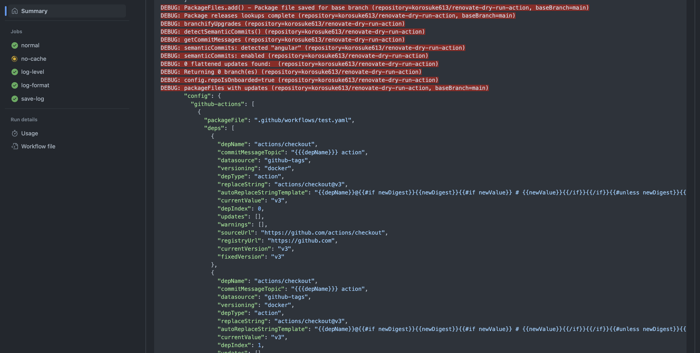

# renovate-dry-run-action
Dry run Renovate and print logs for GitHub Actions.



## Usage

See [action.yaml](action.yaml)

```yaml
steps:
  - uses: actions/checkout@v3
  - uses: korosuke613/renovate-dry-run-action@v1
    with:
      config-file: renovate.json
```


## Release
1. Open [Tagging and Release action page](https://github.com/korosuke613/renovate-dry-run-action/actions/workflows/release.yaml).
2. Click `Run workflow`.
3. Input version.
4. Click `Run workflow`.
